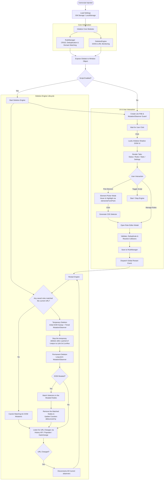

```mermaid
flowchart TD
    %% Initialization Phase
    Start([Userscript Injected]) --> LoadSettings[Load Settings\nGM Storage / LocalStorage]
    LoadSettings --> InitCore[Initialize Core Modules]
    
    subgraph Core Initialization
        InitCore --> RM[RuleManager\nCRUD, Deduplication & Domain Matching]
        InitCore --> DE[DeletionEngine\nDOM & URL Monitoring]
    end
    
    RM --> Expose[Expose Globals to Window Object]
    DE --> Expose
    Expose --> CheckEnabled{Script Enabled?}
    CheckEnabled -- Yes --> StartDE[Start Deletion Engine]
    CheckEnabled -- No --> CreateFAB[Create Lite FAB &\nMutationObserver Guard]
    StartDE --> CreateFAB

    %% Deletion Engine Algorithm
    subgraph Deletion Engine Lifecycle
        StartDE --> MatchURL{Any saved rules matched the current URL?}
	MatchURL -- No --> StopEngine[Cancle Watching for DOM Mutaions] --> URLHook
        MatchURL --> StopTemp[Temporary Deletion\nInitial DOM Sweep + Timed MutationObserver]
	StopTemp --> TempSweep[Stop the temporary deletion after a period of <code>temporaryDeletionMax</code>]
        TempSweep --> PermObserver[Permanent Deletion\nLong-term MutationObserver]
        URLHook[Listen for URL Changes via\nHistory API / Popstate / Hashchange]
        
        URLHook --> URLChanged{URL Changed?}
        URLChanged -- Yes --> DisconnectCurrent[Disconnects All Current observers] --> Restart[Restart Engine] --> MatchURL
        DOMMutated{DOM Mutated?}
	PermObserver --> DOMMutated
        DOMMutated -- Yes --> MatchSelector[Match Selectors in the Mutated Nodes]
        MatchSelector --> Remove[Remove the Matched Nodes &\nUpdate Counters debounced by <code></code>] --> URLHook
        DOMMutated -- No --> URLHook
    end

    %% UI & Interaction Phase
    subgraph UI & User Interaction
        CreateFAB --> Wait[Wait for User Click]
        Wait -- Click --> LazyLoad[Lazily Initialize Shadow DOM UI]
        LazyLoad --> Render[Render Tabs:\nStatus / Rules / Stats / Settings]
        
        Render --> UserAction{User Interaction}
        
        UserAction -- Pick Element --> Picker[Element Picker Mode\nHover & Highlight via elementsFromPoint]
        Picker -- Click --> GenCSS[Generate CSS Selector]
        GenCSS --> Editor[Open Rule Editor Modal]
        
        UserAction -- Manage Rules --> Editor
        Editor --> Validate[Validate, Deduplicate &\nResolve Collisions]
        Validate --> Save[Save to RuleManager]
        Save --> Dispatch[Dispatch Global Restart Event]
        Dispatch --> Restart
        
        UserAction -- Toggle Script --> ToggleDE[Start / Stop Engine]
    end
```
